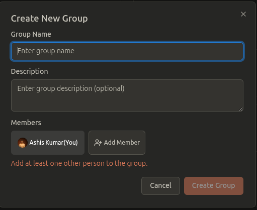

# 🚀 Getting Started: Your First Steps with FairShare

Welcome to **FairShare**! We're excited to help you simplify your shared expenses. This guide will walk you through setting up your account and creating your first group in just a few minutes.

---

### Step 1: Create Your Account 🧑‍💻

First things first, let's get you set up.

1.  Go to our homepage and click the **"Get Started"** button.
2.  You can sign up using your email or a social account like Google.
3.  Once you're done, you'll be automatically logged in and taken to your Dashboard.

---

### Step 2: Explore Your Dashboard 📊

The **Dashboard** is your financial command center. Here's a quick look at what you'll see:

- **Total Balance:** Your overall financial status (whether you're owed money, you owe money, or you're all settled up).
- **You are owed:** The total amount others owe you.
- **You owe:** The total amount you owe others.

Initially, these will all be zero. Let's change that!

---

### Step 3: Create Your First Group 👨‍👩‍👧‍👦

Groups are where the magic happens. You can create a group for any purpose, like a trip, your apartment, or just a group of friends.

1.  On your Dashboard, find and click the **"Create new group"** button.
2.  Give your group a fun and descriptive name (e.g., "Kashmir Trip" or "Room 4B Mates").
3.  Add an optional description if you like.
4.  Click **"Create Group"**.

---

### Step 4: Invite Your Friends 💌

Sharing expenses is better with friends! Here’s how to invite them to your new group:

1.  Once your group is created, you'll land on the **Group Details** page.
2.  Click the **"Invite Members"** button.
3.  You'll get a unique invitation link. Copy this link and share it with your friends via WhatsApp, Messenger, or any other platform.
4.  When they click the link, they'll be prompted to sign up and will be automatically added to your group.

---

### ✅ You're All Set!

Congratulations! Your account is ready, and your first group is set up.

**What's next?** It's time to add your first expense! Check out our next guide to learn how.

➡️ **Next Guide: [How to Add an Expense](./02-how-to-add-expense.md)**
