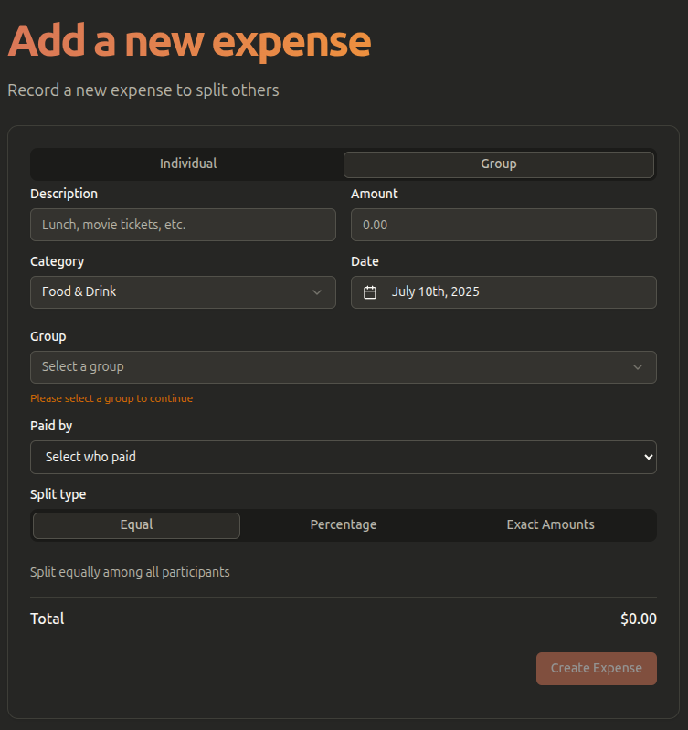
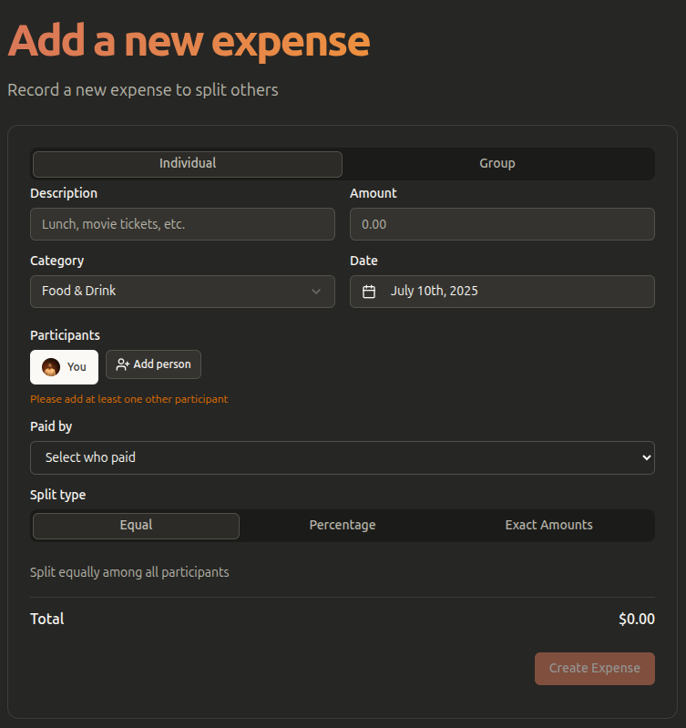

# 🧾 How to Add an Expense

Ready to log your first shared cost? FairShare makes it simple and flexible. You can add expenses for a whole group or just between you and one other person.

This guide will show you how to do both.

---

### Scenario 1: Adding a Group Expense 🍕

This is perfect for costs shared among multiple people, like dinner, groceries, or rent.

**Example:** You and your friends from the "Kashmir Trip" group had dinner, and you paid the bill.

1.  **Go to Your Group:** From the Dashboard, click on your "Kashmir Trip" group.
2.  **Add Expense:** Click the **"Add Expense"** button.
3.  **Fill in the Details:**
    - **Description:** Enter what the expense was for (e.g., "Dinner at The Grand Palace").
    - **Amount:** Enter the total amount you paid (e.g., `3000`).
    - **Paid by:** Select your name from the list.
4.  **Choose How to Split:** This is the most important part!
    - **Split Equally (Default):** The cost will be divided evenly among all group members. This is the most common option.
    - **Split by Percentage:** If someone needs to pay more or less, you can assign percentages (e.g., You pay 40%, Friend A pays 30%, Friend B pays 30%).
    - **Split by Exact Amount:** You can enter the exact amount each person is responsible for.
5.  **Save It!** Click the **"Save Expense"** button.

That's it! FairShare will automatically calculate who owes whom and update everyone's balance in real-time.

---

### Scenario 2: Adding an Individual Expense 🧍‍♂️🧍‍♀️

This is for costs shared with just one other person, outside of any group.

**Example:** You and your colleague, Joy, shared a taxi ride.

1.  **Find the "Add Expense" Button:** You can usually find this on your Dashboard or a dedicated "Expenses" page.
2.  **Select Participants:** Instead of a group, you'll see a list of your contacts. Select **Joy**.
3.  **Fill in the Details:** Just like a group expense, add a description ("Taxi Ride to Office"), amount, and who paid.
4.  **Split the Cost:** You can still split it equally, by percentage, or by exact amounts, but only between the two of you.
5.  **Save It!**

Your personal balance with Joy will be updated instantly.

---

### 🎉 You're a Pro!

You now know how to add any kind of shared expense in FairShare. Keep track of your costs and enjoy a hassle-free financial life with your friends!

⬅️ **[Back to Documentation Hub](../README.md)**
